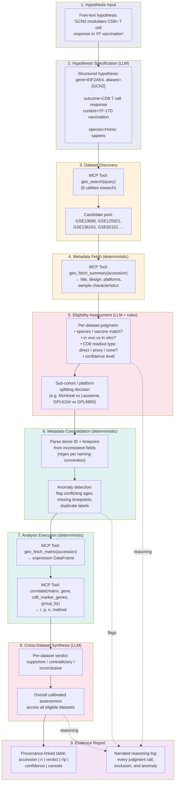

```mermaid
flowchart TB
    subgraph INPUT["1. Hypothesis Input"]
        H["Free-text hypothesis:\n'GCN2 modulates CD8+ T cell\nresponse in YF vaccination'"]
    end

    subgraph SPEC["2. Hypothesis Specification (LLM)"]
        S["Structured hypothesis:<br/>gene=EIF2AK4, aliases=[GCN2]<br/>
        outcome=CD8 T cell response<br/>context=YF-17D vaccination<br/>
        species=Homo sapiens"]
    end

    subgraph DISCOVER["3. Dataset Discovery"]
        D1["MCP Tool:\ngeo_search(query)\n(E-utilities esearch)"]
        D2["Candidate pool:\nGSE13699, GSE125921,\nGSE136163, GSE82152, ..."]
    end

    subgraph FETCH["4. Metadata Fetch (deterministic)"]
        F1["MCP Tool:\ngeo_fetch_summary(accession)\n→ title, design, platforms,\nsample characteristics"]
    end

    subgraph ELIGIBILITY["5. Eligibility Assessment (LLM + rules)"]
        E1["Per-dataset judgment:\n• species / vaccine match?\n• in vivo vs in vitro?\n• CD8 readout type:\n  direct / proxy / none?\n• confidence level"]
        E2["Sub-cohort / platform\nsplitting decision\n(e.g. Montreal vs Lausanne,\nGPL6104 vs GPL6883)"]
    end

    subgraph PARSE["6. Metadata Consolidation (deterministic)"]
        P1["Parse donor ID + timepoint\nfrom inconsistent fields\n(regex per naming convention)"]
        P2["Anomaly detection:\nflag conflicting ages,\nmissing timepoints,\nduplicate labels"]
    end

    subgraph ANALYZE["7. Analysis Execution (deterministic)"]
        A1["MCP Tool:\ngeo_fetch_matrix(accession)\n→ expression DataFrame"]
        A2["MCP Tool:\ncorrelate(matrix, gene,\ncd8_marker_genes, group_by)\n→ r, p, n, method"]
    end

    subgraph SYNTH["8. Cross-Dataset Synthesis (LLM)"]
        SY1["Per-dataset verdict:\nsupportive / contradictory /\ninconclusive"]
        SY2["Overall calibrated assessment\nacross all eligible datasets"]
    end

    subgraph REPORT["9. Evidence Report"]
        R1["Provenance-linked table:\naccession | n | verdict | r/p |\nconfidence | caveats"]
        R2["Narrated reasoning log:\nevery judgment call,\nexclusion, and anomaly"]
    end

    H --> S --> D1 --> D2 --> F1 --> E1
    E1 --> E2 --> P1 --> P2 --> A1 --> A2 --> SY1 --> SY2 --> R1
    P2 -.flags.-> R2
    E1 -.reasoning.-> R2
    SY2 -.reasoning.-> R2

    style INPUT fill:#e8eaf6
    style SPEC fill:#e8eaf6
    style DISCOVER fill:#fff3e0
    style FETCH fill:#fff3e0
    style ELIGIBILITY fill:#fce4ec
    style PARSE fill:#e0f2f1
    style ANALYZE fill:#e0f2f1
    style SYNTH fill:#fce4ec
    style REPORT fill:#f3e5f5
```
